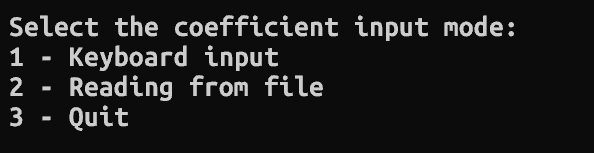
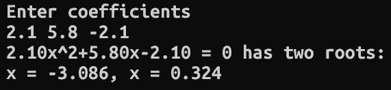
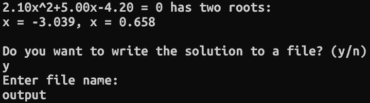
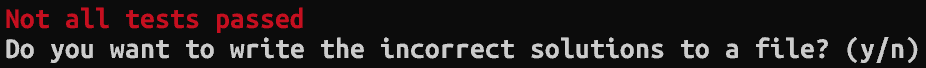
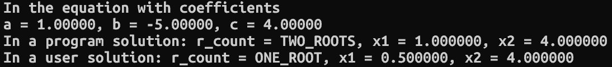
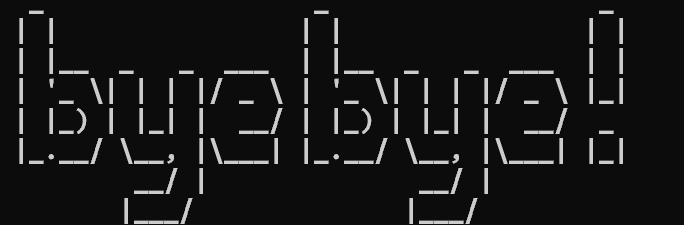

# Equation solver (Решатель уравнений)


---

Программа для решения уравнений не выше 2 степени:
- 0 степени (константа): `с = 0`
- 1 степени (линейные): `bx + c = 0`
- 2 степени (квадратные): `ax^2 + bx + c = 0`

## Зависимости

- `g++` - Компилятор C++
- `make` - Утилита для автоматизации сборки

## Сборка

```bash
git clone https://github.com/Sfinkymvp/Equation_solver
cd Equation_solver
make solve
```

После сборки можно запустить программу:

```bash
./solve
```

## Доступные опции

- `--ui`     Выключение стандартного интерфейса
- `--help`   Справка
- `--test`   Режим работы с пользовательскими тестами

## Возможности

Программа имеет 2 основных режима работы:
- Решение уравнения (Стандартный режим)
- Пользовательские тесты

## Стандартный режим

Пользователю предлагается выбрать один из двух вариантов ввода:



После этого программа решает уравнение и выводит сообщение с ответом

### Формат входных данных

Коэффициенты уравнений не выше второй степени:

```bash
<a> <b> <c>
```

**При получении коэффициентов уравнения из файла следует придерживаться этого же формата**

### Пример работы



### Дополнительные возможности

По желанию пользователя можно записать ответ в файл, для этого нужно ввести имя файла:



## Режим работы с пользовательскими тестами

Данный режим включается с помощью опции --test

```bash
./solve --test
```
Пользователю необходимо ввести имя файла с находящимися в нем тестами  
После этого программа попытается решить их и выведет сообщение со статусом решения:


 

Пользователь может записать неудачные тесты в файл:



### Формат входных данных

```bash
<a> <b> <c> <roots_count> <x1> <x2>
```

**На месте <roots_count> пишется количество корней в соответствии с форматом:**
- `0` Нет корней
- `1` Один корень
- `2` Два корня
- `-1` Бесконечность корней

**При отсутствии корня его место заполняется нулем**

## Ограничения

- Поддерживается работа только с действительными числами
- Существует погрешность при решении уравнения

---


